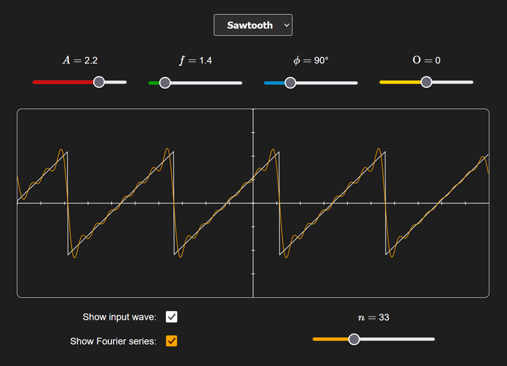

[](LICENSE)


# Fourier Series Visualizer

An interactive web tool for exploring on how Fourier series approximate periodic functions.

<p align="center">
    
</p>


## Table of Contents

- [Overview](#overview)
- [Features](#features)
- [Project Structure](#project-structure)
- [Build & Run](#build--run)
- [Mathematics & Theory](#mathematics--theory)
- [License](#license)


## Overview

This tool lets you visualize how a Fourier series converges to a given periodic function. Select a wave shape and watch how adding more modes brings the approximation curve closer to the original function.

1. Select a wave type.
2. Adjust amplitude, frequency, phase and offset via sliders.
3. The Fourier series is (determined numerically using the Simpson's rule) drawn on the canvas alongside the original wave.
4. Increase modes slider to observe convergence.


## Features

- Four wave shapes: rectangular, sawtooth, triangular, and sine
- Real-time wave parameter controls: amplitude $A$, frequency $f$, phase $\phi$, and vertical offset $O$
- Adjustable number of modes $n$ (1–100)
- Toggle the input wave and Fourier series visibility independently


## Project Structure

```
fourier-visualizer/
├─ docs/images       # Documentation iamges
├─ src/
│  ├─ index.html
│  ├─ script.js
│  └─ style.css
├─ LICENSE
└─ README.md
```


## Build & Run

Clone the repository and open `index.html` in a browser.

```sh
git clone https://github.com/luniphy/fourier-visualizer.git
```

## Mathematics & Theory

Any periodic function $f(x)$ can be expressed as a sum of $\sin(x)$ and $\cos(x)$ terms:

$$
f(x) = \frac{a_0}{2} + \sum_{n = 1}^{\infty} ( a_n \cos(nx) + b_n \sin(nx) )
$$

The Fourier coefficients $a_n$ and $b_n$ are defined by the integrals:

$$
a_n = \frac{1}{\pi} \int_{-\pi}^{\pi} f(x) \cos(nx) \mathrm{d}x,
$$
$$
b_n = \frac{1}{\pi} \int_{-\pi}^{\pi} f(x) \sin(nx) \mathrm{d}x
$$

For $n→\infty$ the series converges to $f(x)$.


## License

MIT © [luniphy](https://github.com/luniphy)